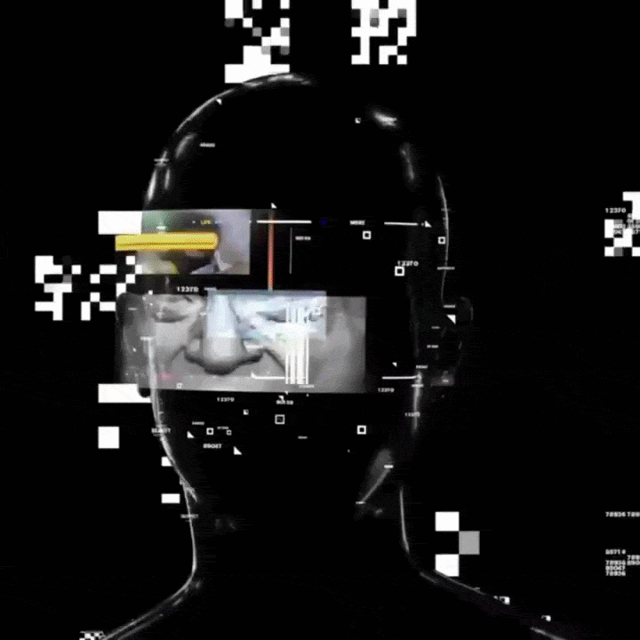

<h1 align="left">HEY THERE, I'M ACHINTHA</h1>

 
<table>
<tr>
<td width="60%">
  
## Ø About Me

<h4>Software Engineering student passionate about crafting sleek, 
high-performance web applications, mobile apps, and interactive 
digital experiences. Focused on modern architectures, creative game development, 
and building intuitive UI systems with clean visual hierarchy.</h4>

</td>
<td width="20%">

</td>
</tr>
</table>

### 🔗 Follow Me On

<!-- Replace these with your real links -->

  <!-- 
   -->
  

 

## Languages & Tools

  

